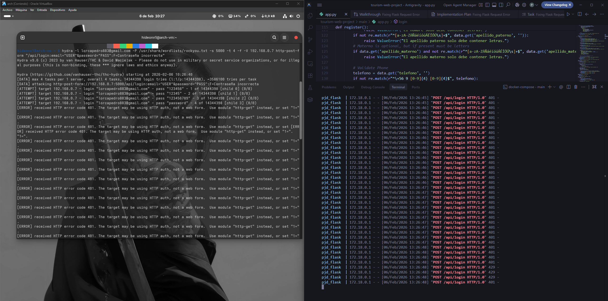
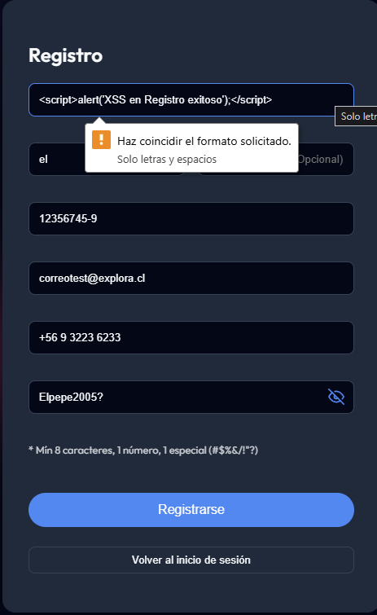
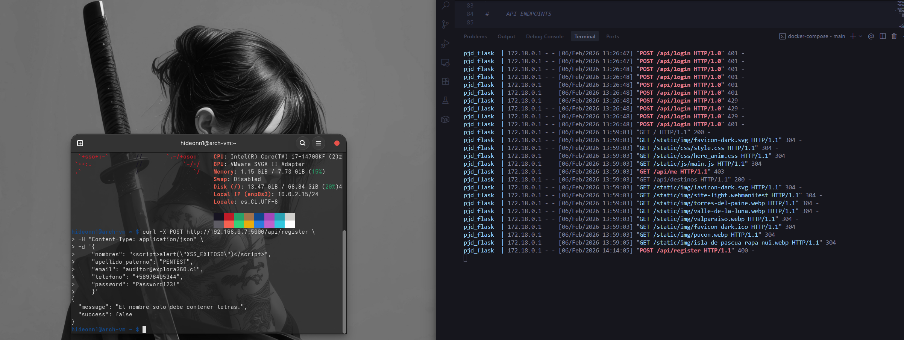

# 🛡️ Reporte de Auditoría de Seguridad: Explora360 06/02/2026

Este documento detalla las pruebas de penetración y las medidas de mitigación implementadas para asegurar la integridad y disponibilidad de la plataforma Explora360.

## 1. Resumen de Defensas Implementadas

*   **Capa de Aplicación:** Validación estricta de tipos de datos mediante expresiones regulares (Regex).
*   **Capa de Sesión:** Implementación de `EncryptedCookieSessionInterface` con cifrado AES-GCM.
*   **Capa de Red:** Control de flujo y tasa de peticiones mediante `Flask-Limiter` y `ProxyFix`.

## 2. Evidencia de Pruebas (Pentesting)

### A. Mitigación de Fuerza Bruta (Rate Limiting)

Se realizó un ataque coordinado mediante **Hydra v9.6** desde un entorno Arch Linux para estresar el endpoint de autenticación.

**Resultado:** Bloqueo exitoso. El servidor detectó la anomalía y respondió con códigos HTTP 429 (Too Many Requests) tras alcanzar el límite configurado de 5 intentos por minuto.

*Figura 1: Logs de Flask (derecha) mostrando el rechazo de peticiones una vez activada la defensa.*

### B. Validación de Backend contra Inyección (XSS Bypass)

Se intentó realizar un bypass de las validaciones del frontend (HTML5) enviando un payload de Javascript directamente al servidor mediante `curl`.

**Payload:** ``

**Resultado:** Rechazo íntegro. Los filtros del frontend (HTML5) y backend (Regex) bloquearon el payload.

*Figura 2: Respuesta del servidor bloqueando caracteres especiales en el campo 'nombres'.*

### C. Integridad de Sesión e IDOR

Se auditó la arquitectura de acceso a datos personales para prevenir referencias directas inseguras a objetos (IDOR).

**Prueba:** Uso del endpoint `/api/me` para obtener datos basados estrictamente en el contenido de la cookie cifrada.

**Resultado:** Rechazo íntegro. El backend respondió con un 400 Bad Request, validando que los datos persistidos en la base de datos MySQL son seguros y libres de scripts.

*Figura 3: Respuesta del servidor validando que los datos persistidos en la base de datos MySQL son seguros y libres de scripts.*

## Reporte auditoría de seguridad 07/02/2026

### 1. Herramientas de auditoría
Se ha integrado la herramienta Trivy para auditar la imagen Docker y detectar vulnerabilidades.

Análisis del Sistema Operativo (OS Scanning): Detección de CVEs en la imagen base de Debian.

Análisis de Composición de Software (SCA): Identificación de librerías de Python vulnerables en requirements.txt.¨

### 2. Mitigaciones implementadas

**A. Hardening de Imagen Docker (Multi-stage Build)**
Se realizó una refactorización completa del Dockerfile migrando de una construcción monolítica a una de múltiples etapas (Multi-stage).

Resultado: Reducción de la superficie de ataque al eliminar herramientas de compilación (gcc, pkg-config, binutils) en la imagen final de producción.

Impacto: El inventario de paquetes instalados se redujo de 140 a 103, eliminando vectores de ataque potenciales.

**B. Gestión de Dependencias y Parches (SCA)**
Se detectaron y mitigaron vulnerabilidades críticas de Path Traversal y Escalada de Privilegios mediante el anclaje de versiones seguras en las dependencias transitivas:

jaraco.context: Actualizado de v5.3.0 a v6.1.0 (CVE-2026-23949 mitigado).

wheel: Actualizado de v0.45.1 a v0.46.3 (CVE-2026-24049 mitigado).

setuptools: Forzado a v81.0.0 para resolver vulnerabilidades de "vendoring" interno.

Estado Actual: La capa de librerías de Python reporta 0 vulnerabilidades críticas/altas.

### 3. Análisis de riesgo residual

A fecha de esta auditoría, el reporte muestra 65 alertas en la capa del sistema operativo (Debian 13.3 Trixie).

*Figura 4: Extracto del reporte de vulnerabilidades al finalizar auditoría.*

Evaluación: Estas vulnerabilidades pertenecen al kernel de Linux y librerías del sistema (libc6) que actualmente no cuentan con un parche oficial (Fixed Version) por parte de los mantenedores de Debian.

Estrategia: Se acepta el riesgo de forma temporal. Se ha programado un escaneo semanal automatizado para aplicar los parches en cuanto Debian libere las actualizaciones correspondientes.

